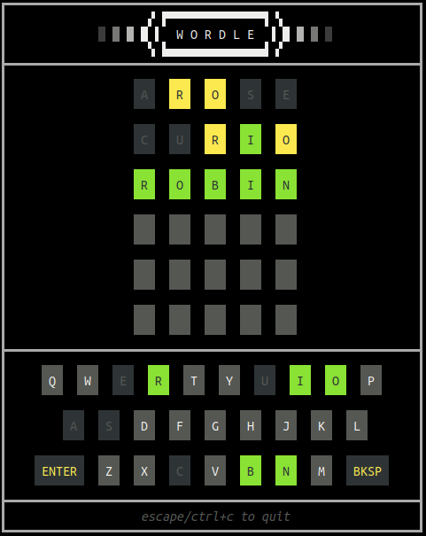

# go-wordle

A golang implementation of the popular New York Times game [Wordle](https://www.nytimes.com/games/wordle/index.html).

## Usage
* `go run .`
* Type your answer and `Enter` to attempt it
* Requires an interactive terminal

## Features
* Hinting mode with `-hints`
  * Shows recommended/possible answers above the keyboard
* Demo mode with `-demo`
  * Automated solving with or without a pre-set answer
  * Uses the built-in hinting system to choose answers
  * No user input allowed (except for Esc/Ctrl+C)
* Helper mode to solve external Wordle puzzles with `-helper`
  * If you are using this tool as a cheat and solve Wordle puzzles elsewhere ;)
  * Show hints and helps record the results to get you to the answer

## Automated Demo Mode

