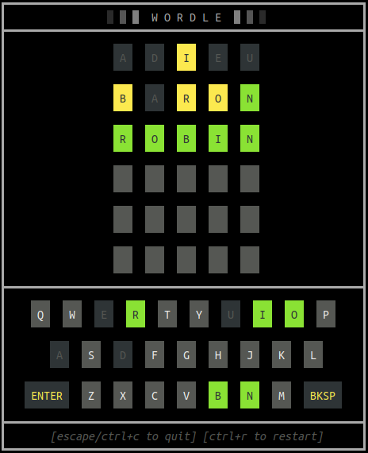

# go-wordle

A golang implementation of the popular New York Times game [Wordle](https://www.nytimes.com/games/wordle/index.html).

Note:
* Press `Esc` or `Ctrl+C` to quit
* Type the word and `Enter` to attempt it
* Requires an interactive terminal
